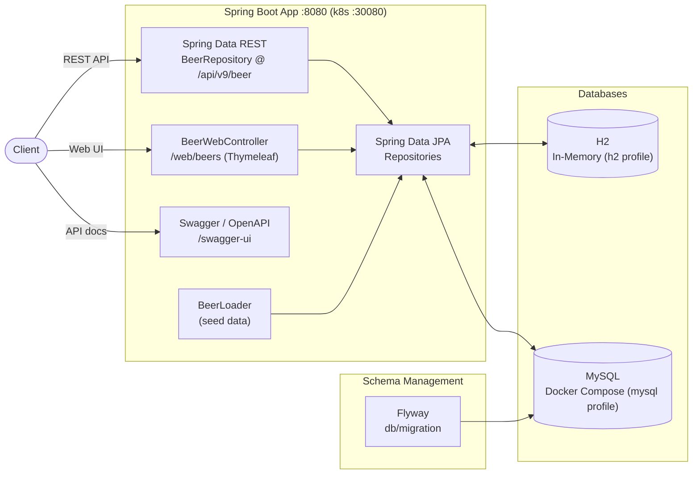
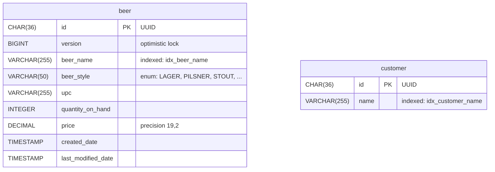

# Spring Data REST - Example Project

This project demonstrates the implementation of a Spring Data REST application for managing beer data. It showcases the power and simplicity of Spring Data REST in creating RESTful APIs with minimal boilerplate code. The application provides CRUD operations for beer entities, supports pagination, sorting, and custom query methods. It includes both a RESTful API and a web interface for user interaction.

Key features:
- RESTful API for beer data management
- Custom query methods for searching beers by name, style, and UPC
- Web interface for viewing and navigating beer data
- Integration with MySQL database (with H2 option for development)
- Flyway for database migration management
- Docker and Kubernetes support for easy deployment
- Swagger/OpenAPI documentation

## Architecture Overview



## Database Schema



## Swagger/Openapi Url

- local: http://localhost:8080/swagger-ui/index.html, http://localhost:8080/v3/api-docs
- k8s: http://localhost:30080/swagger-ui/index.html, http://localhost:30080/v3/api-docs

## Web Interface

This application includes a web interface that allows users to interact with the beer data through a browser. The web interface provides the following features:

- View a paginated list of beers
- Navigate through pages of beer listings
- View details of individual beers

To access the web interface, start the application and navigate to:

- local: http://localhost:8080/web/beers
- k8s: http://localhost:30080/web/beers

## Flyway

To enable Flyway in the MySQL profile, override the following properties when starting the application:
- `spring.flyway.enabled = true`
- `spring.docker.compose.file = compose-mysql.yaml`

This profile starts MySQL on port 3306 using the Docker Compose file `compose-mysql.yaml`.

## Docker

Docker Compose file initially use the startup script located in `src/scripts`. These scripts create the database and users.

### Deployment with Helm

Be aware that we are using a different namespace here (not default).

Go to the directory where the tgz file has been created after 'mvn install'

```powershell
cd target/helm/repo
```

unpack

```powershell
$file = Get-ChildItem -Filter sdjpa-spring-data-rest-chart-*.tgz | Select-Object -First 1
tar -xvf $file.Name
```

install

```powershell
$APPLICATION_NAME = Get-ChildItem -Directory | Where-Object { $_.LastWriteTime -ge $file.LastWriteTime } | Select-Object -ExpandProperty Name
helm upgrade --install $APPLICATION_NAME ./$APPLICATION_NAME --namespace sdjpa-spring-data-rest --create-namespace --wait --timeout 5m --debug
```

show logs

```powershell
kubectl get pods -n sdjpa-spring-data-rest
```

replace $POD with pods from the command above

```powershell
kubectl logs $POD -n sdjpa-spring-data-rest --all-containers
```

Show Endpoints

```powershell
kubectl get endpoints -n sdjpa-spring-data-rest
```

test

```powershell
helm test $APPLICATION_NAME --namespace sdjpa-spring-data-rest --logs
```

status

```powershell
helm status $APPLICATION_NAME --namespace sdjpa-spring-data-rest
```

uninstall

```powershell
helm uninstall $APPLICATION_NAME  --namespace sdjpa-spring-data-rest
```

delete all

```powershell
kubectl delete all --all -n sdjpa-spring-data-rest
```

create busybox sidecar

```powershell
kubectl run busybox-test --rm -it --image=busybox:1.36 --namespace=sdjpa-spring-data-rest --command -- sh
```

You can use the actuator rest call to verify via port 30080

## Running the Application

1. Choose between h2 or mysql for database schema management. (you can use one of the preconfigured intellij runners)
2. Start the application with the appropriate profile and properties.
3. The application will use Docker Compose to start MySQL and apply the database schema changes.

## Sandbox (local dev environment)

The sandbox is provisioned by the opencode-sandbox-kit and runs as a Docker container. It mounts this
repo, starts the agent, and connects the IntelliJ MCP server. The app runs on port `8080`; `compose-mysql.yaml`
provides MySQL.

Allow the kit source (GitHub without cloning):

```powershell
sbx settings set kit.allowedSources --% "[\"docker.io/\",\"github.com/dboeckli/\"]
```

Start a new sandbox:

```powershell
sbx run opencode `
    --kit "git+https://github.com/dboeckli/opencode-sandbox-kit.git#dir=opencode-agent" `
    --template docker.io/domboeckli/sbx-opencode-tooling:latest `
    --skills=off `
    --static-mcp idea `
    . `
    "C:\development\maven-repo:ro"
```

Start the sandbox with Kubernetes support:

```powershell
sbx run opencode `
    --kit "git+https://github.com/dboeckli/opencode-sandbox-kit.git#dir=opencode-agent" `
    --template docker.io/domboeckli/sbx-opencode-tooling:latest `
    --skills=off `
    --static-mcp idea `
    . `
    "C:\development\maven-repo:ro" `
    "$env:USERPROFILE\.kube:ro"
```

Claude Code (Home) and Mammouth Code variants:

```powershell
sbx run claude `
    --kit "git+https://github.com/dboeckli/opencode-sandbox-kit.git#dir=opencode-agent" `
    --template docker.io/domboeckli/sbx-claude-tooling:latest `
    --skills=off `
    --static-mcp idea `
    . `
    "C:\development\maven-repo:ro"
```

```powershell
sbx run "git+https://github.com/dboeckli/opencode-sandbox-kit.git#dir=mammouth-agent" `
    --kit-arg imageTag=latest `
    --skills=off `
    --static-mcp idea `
    . `
    "C:\development\maven-repo:ro"
```

### Start the app

Start MySQL (H2 needs no Docker):

```shell
docker compose -f compose-mysql.yaml up
```

Then run one of the IntelliJ run configurations (`.run/Spring6Application h2.run.xml` or the MySQL
one) or start via `./mvnw spring-boot:run -Dspring-boot.run.profiles=h2`.

### Sandbox build quirk

The sandbox mounts the repo via filesystem passthrough, which blocks symlinks — Spotless's `npm install`
(prettier) would fail with `EPERM` unless npm skips bin links. The kit sets `npm_config_bin_links=false`
globally, so no manual export is needed.
